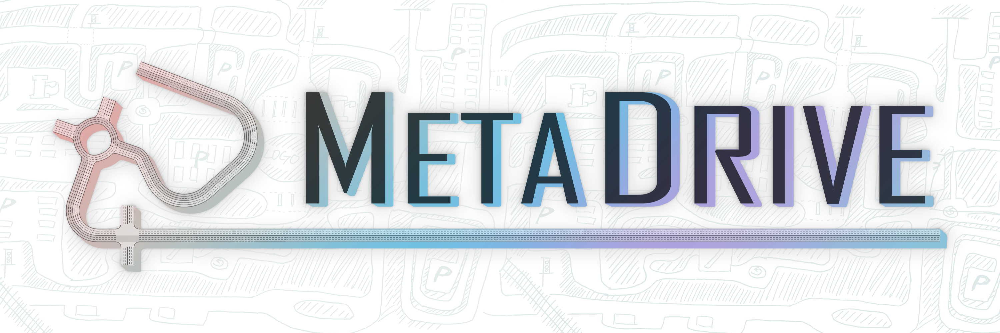

<br>



<br>

# MetaDrive: Composing Diverse Driving Scenarios for Generalizable RL


<div style="text-align: center; width:100%; margin: 0 auto; display: inline-block">
<strong>
[
<a href="https://metadrive-simulator.readthedocs.io">Documentation</a>
|
<a href="https://www.youtube.com/embed/3ziJPqC_-T4">Demo Video</a>
]
</strong>
</div>

<br>

MetaDrive is a driving simulator with the following key features:

- **Compositional**: It supports generating infinite scenes with various road maps and traffic settings for the research of generalizable RL. 
- **Lightweight**: It is easy to install and run. It can run up to 300 FPS on a standard PC.
- **Realistic**: Accurate physics simulation and multiple sensory input including Lidar, RGB images, top-down semantic map and first-person view images. 


## 🛠 Quick Start
Install MetaDrive via:

```bash
git clone https://github.com/decisionforce/metadrive.git
cd metadrive
pip install numpy cython
pip install -e .
```

or

```bash
pip install metadrive-simulator
```
*Note that the program is tested on both Linux and Windows. Some control and display issues in MacOS wait to be solved*

You can verify the installation of MetaDrive via running the testing script:

```bash
# Go to a folder where no sub-folder calls metadrive
python -m metadrive.examples.profile_metadrive
```

*Note that please do not run the above command in a folder that has a sub-folder called `./metadrive`.*

## 🚕 Examples

Run the following command to launch a simple driving scenario with auto-drive mode on. Press W, A, S, D to drive the vehicle manually.

```bash
python -m metadrive.examples.drive_in_single_agent_env
```
Run the following command to launch a safe driving scenario, which includes more complex obstacles and cost to be yielded. 

```bash
python -m metadrive.examples.drive_in_safe_metadrive_env
```

You can also launch an instance of Multi-Agent scenario as follows

```bash
python -m metadrive.examples.drive_in_multi_agent_env --env roundabout
```

or launch and render in pygame front end 

```bash
python -m metadrive.examples.drive_in_multi_agent_env --pygame_render --env roundabout
```

env argument could be:
- `roundabout` (default)
- `intersection`
- `tollgate`
- `bottleneck`
- `parkinglot`
- `pgmap`

Run the example of procedural generation of a new map as:

```bash
python -m metadrive.examples.procedural_generation
```

*Note that the above four scripts can not be ran in a headless machine.*
*Please refer to the installation guideline in documentation for more information about how to launch runing in a headless machine.*

Run the following command to draw the generated maps from procedural generation:

```bash
python -m metadrive.examples.draw_maps
```

To build the RL environment in python script, you can simply code in the OpenAI gym format as:

```python
import metadrive  # Import this package to register the environment!
import gym

env = gym.make("MetaDrive-v0", config=dict(use_render=True))
# env = metadrive.MetaDriveEnv(config=dict(environment_num=100))  # Or build environment from class
env.reset()
for i in range(1000):
    obs, reward, done, info = env.step(env.action_space.sample())  # Use random policy
    env.render()
    if done:
        env.reset()
env.close()
```


## 🏫 Documentations

Find more details in: [MetaDrive](https://metadrive-simulator.readthedocs.io)


## 📎 References

Working in Progress!

[](http://github.com/decisionforce/metadrive/actions)
[](https://codecov.io/gh/decisionforce/metadrive)
[](https://metadrive.readthedocs.io)
[](https://github.com/decisionforce/metadrive/blob/main/LICENSE.txt)
[](https://www.codacy.com/gh/decisionforce/metadrive/dashboard?utm_source=github.com&amp;utm_medium=referral&amp;utm_content=decisionforce/metadrive&amp;utm_campaign=Badge_Grade)
[](https://github.com/decisionforce/metadrive/graphs/contributors)
